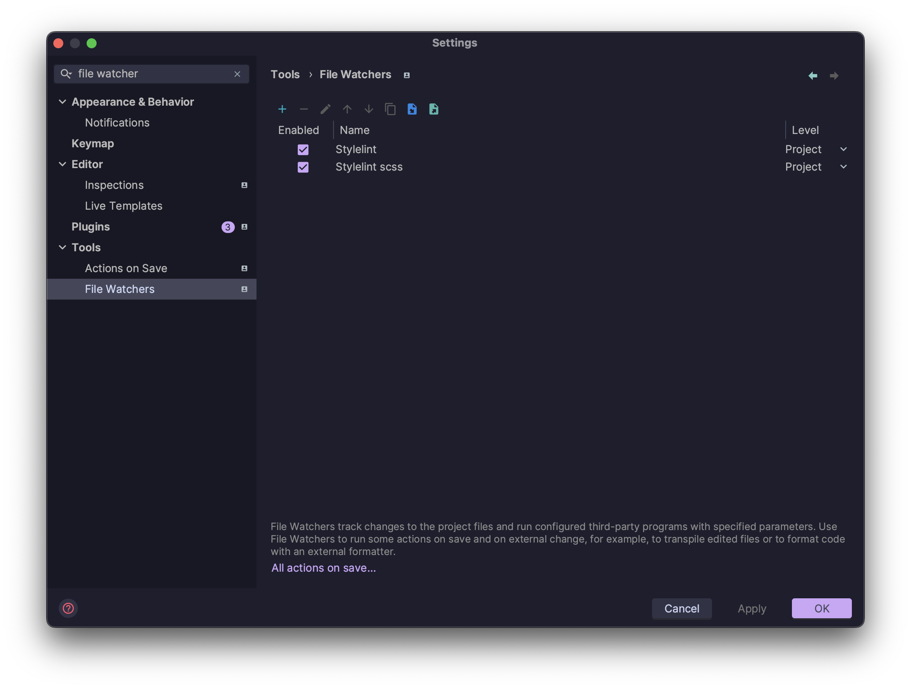
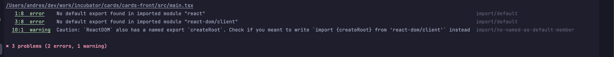
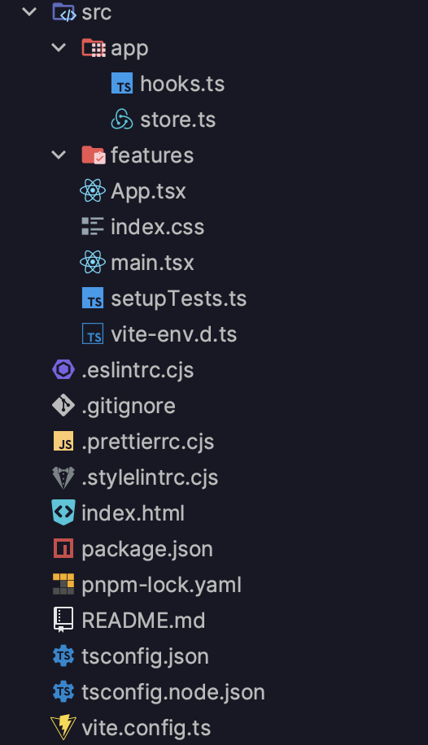

## Create project

```bash
npx degit reduxjs/redux-templates/packages/vite-template-redux my-app
```
## Update dependencies
This template comes with outdated packages. To update them run:
```bash
pnpm update
```

## Install dependencies

### Linters

```bash
pnpm i @it-incubator/eslint-config @it-incubator/prettier-config @it-incubator/stylelint-config stylelint -D
```

### SASS

```bash
pnpm i sass -D
```

## Configure linters

### .prettierrc.cjs

```js
module.exports = {
  ...require('@it-incubator/prettier-config'),
  //override settings here
}
```

### .eslintrc.cjs

```js
module.exports = {
  extends: '@it-incubator/eslint-config',
  rules: { 'no-console': ['warn', { allow: ['warn', 'error'] }] },
}
```

### .stylelintrc.cjs

```js
module.exports = {
  extends: '@it-incubator/stylelint-config',
}
```

## Configure WebStorm

### Enable ESLint


### Enable Prettier
```
{**/*,*}.{js,ts,jsx,tsx,vue,astro,cjs,mjs,css,scss}
```


### Enable stylelint


### Configure SASS autofix on save
Copy watchers.xml from this repo onto your computer and import it in Settings | Tools | File Watchers.  
Should look like this after importing:


### Add scripts to package.json (replacing the defaults if needed)

```json lines
{
  "scripts": {
    "format": "prettier --write src",
    "lint": "eslint --fix {src}/**/*.{tsx,ts,jsx,js} --no-error-on-unmatched-pattern && stylelint --fix src/{,*/}*.scss",
  }
}
```

### Remove boilerplate

* Delete src -> features -> counter
* Delete App.test.tsx
* Delete App.css
* Clean up App.tsx:

```tsx
export function App() {
  return <div>Hello</div>
}
```

* Clean up store.ts:
```ts
import { configureStore, ThunkAction, Action } from '@reduxjs/toolkit'

export const store = configureStore({
  reducer: {},
})

export type AppDispatch = typeof store.dispatch
export type RootState = ReturnType<typeof store.getState>
export type AppThunk<ReturnType = void> = ThunkAction<
  ReturnType,
  RootState,
  unknown,
  Action<string>
>
```

### Apply linters

* Prettier

```bash
pnpm run format
```

* Eslint and Stylelint
```bash
pnpm run lint
```

Some eslint errors will not be automatically fixed, so you'll have to do it yourself, i.e.


Try to figure out how to fix it yourself, but if you can't here is the code:
```tsx
import './index.css'
import { StrictMode } from 'react'

import { createRoot } from 'react-dom/client'
import { Provider } from 'react-redux'

import { App } from './App'
import { store } from './app/store'

createRoot(document.getElementById('root')!).render(
  <StrictMode>
    <Provider store={store}>
      <App />
    </Provider>
  </StrictMode>
)

```
Our config uses import/order plugin which requires your
__css/scss files to be placed either first or last in the imports__ (see example above), 
otherwise you will get unfixable errors


## Final folder structure

This is how your folder structure should look like by the end of this chapter:
